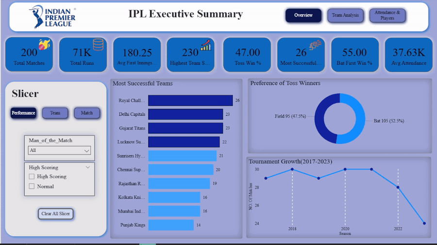
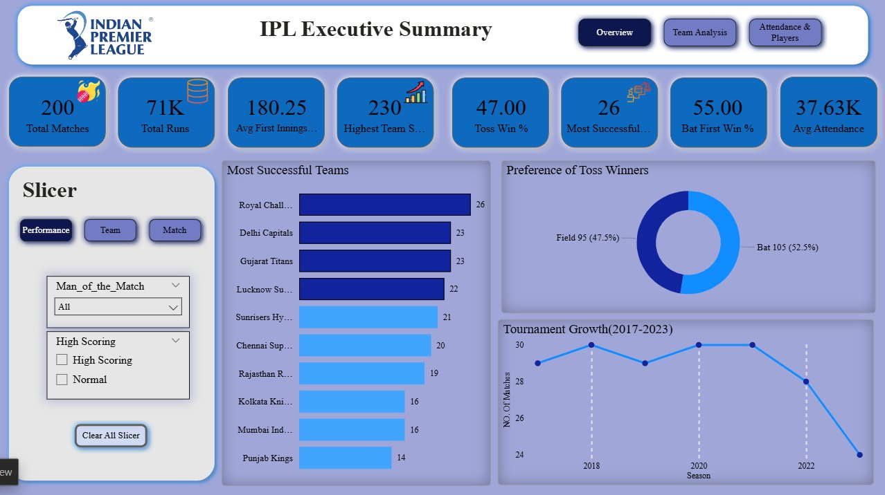
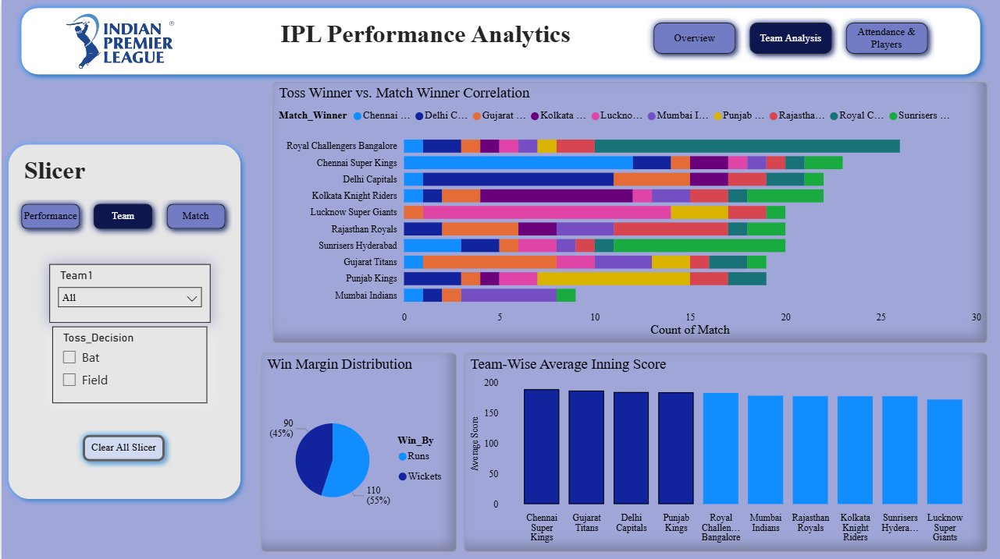
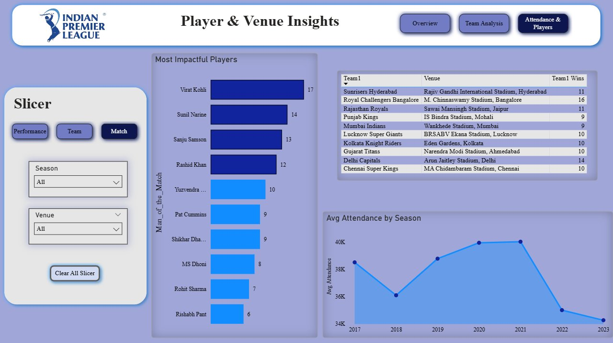

# 🏏 IPL Pulse — Cricket Analytics Dashboard

---
## 📌 Project Overview

**IPL Pulse** is a multi-page interactive Power BI dashboard that transforms raw Indian Premier League (IPL) match data from **2017 to 2023** into compelling, actionable insights. Covering **200 matches**, **10 teams**, and **10 iconic venues**, this project simulates a real-world sports analytics use case — exploring team strategies, player brilliance, toss dynamics, and fan attendance trends through rich visual storytelling.

---

## 🎬Dashboard Demo

---

## 📊 Dashboard Pages

### Page 1 — IPL Executive Summary (Overview)
A high-level snapshot of tournament-wide KPIs including Total Matches, Total Runs, Avg First Innings Score, Toss Win %, Bat First Win %, and Avg Attendance — with slicers for Man of the Match and High Scoring match filter.

---

### Page 2 — IPL Performance Analytics (Team Analysis)
Deep-dive into team vs team dynamics, toss-winner vs match-winner correlation, win margin distribution (runs vs wickets), and team-wise average inning scores.

---

### Page 3 — Player & Venue Insights (Attendance & Players)
Spotlight on the most impactful players by Man of the Match count, home ground win advantages per team, and seasonal stadium attendance trends from 2017 to 2023.

---

## ❓ Questions & KPIs

| # | Business Question | KPI / Metric |
|---|-------------------|--------------|
| 1 | How many total matches were played across all seasons? | Total Matches = **200** |
| 2 | Which team dominates the Man of the Match tally? | Most Successful Team Award Count |
| 3 | Does winning the toss give a real match advantage? | Toss Win % = **47%** |
| 4 | Do teams prefer to bat or field after winning the toss? | Toss Decision Distribution |
| 5 | Is batting first or chasing a better strategy? | Bat First Win % = **55%** |
| 6 | What is the average score set in the first innings? | Avg First Innings Score = **180.25** |
| 7 | What is the highest team score recorded? | Highest Team Score = **230** |
| 8 | Who are the most impactful players by MoM awards? | Player-wise MoM Count |
| 9 | Which teams have the strongest home ground advantage? | Team1 Home Wins by Venue |
| 10 | How has fan attendance changed season over season? | Avg Attendance = **37.63K** |
| 11 | How are matches won — by runs or by wickets? | Win Margin Distribution |
| 12 | Which teams post the highest average innings scores? | Team-wise Avg Inning Score |

---

## 🛠️ Tools Used

| Tool | Purpose |
|------|---------|
| **Power BI Desktop** | Dashboard development, DAX, visuals |
| **Power Query** | Data cleaning & transformation |
| **DAX** | Custom measures & calculated columns |
| **Microsoft Excel** | Data exploration & pre-processing |

> **"Where Every Match Tells a Story — Decoded by Data."**

---

## ✅ Final Conclusion

The **IPL Pulse Dashboard** reveals several data-driven paradoxes in cricket strategy. While toss winners prefer to field, batting-first teams actually hold a marginal statistical edge in match outcomes — a finding that challenges conventional T20 wisdom and opens doors for further analysis.

Player consistency remains a reliable indicator of team success: Kohli, Narine, and Samson regularly appear as match-deciding performers. Additionally, home venue advantage is real and quantifiable, with certain franchises showing significantly higher win rates at their home grounds.

From a portfolio perspective, this project demonstrates proficiency in:
- **End-to-end data pipeline** (raw CSV → cleaned data → modelled → visualized)
- **Advanced DAX** for dynamic measures and KPI calculations
- **Dashboard UX design** with multi-page navigation and interactive slicers
- **Storytelling with data** to surface non-obvious, actionable insights

---

## 📁 Dataset

| Attribute | Detail |
|-----------|--------|
| **File** | `IPL_Match_Data.csv` |
| **Source** | IPL Match Data (Structured) |
| **Total Records** | 200 matches |
| **Seasons Covered** | 2017 – 2023 |
| **Teams** | 10 IPL franchises |
| **Venues** | 10 stadiums across India |
> 📂 Full dataset available in [`IPL_Match_Data.csv`](IPL_Match_Data.csv)

---

## 🤝 Connect With Me

 

> 💬 Open to feedback, collaboration, and data analytics discussions!
---
